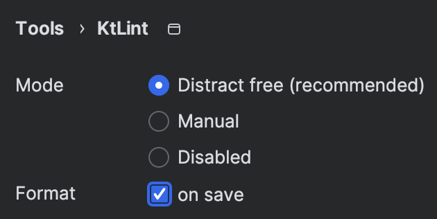

A quick one, this time. Let's talk about code formatting and how to automate it.

## _Why formatting code is important?_{:.sidenote-number}

_That is, why is it important until we all program in [Unison](https://www.unison-lang.org)?_{:.sidenote}

You like tabs, I like spaces. She likes curly braces on each `if` branch, they like them only when the `if` spreads more than one line. There is no accounting for taste.

But we all agree on collective ownership of code, right? That's one of these practices that comes from XP but many have forgotten that. The _Scrum Guide does not even mention code ownership_{:.sidenote-number}_In fact, I just checked, the Scrum Guide has 2 occurrences of the char sequence "code", both in this url:  https://creativecommons.org/licenses/by-sa/4.0/legalcode_{:.sidenote} and, yet, I find it really difficult to have even an ounce of agility if you don't have collective code ownership. Pardon me, I'm going off on a tangent here...

So, assuming you want your code to belong to all the development team, we need some agreements. Formatting agreements, to begin with. Spaces, no tabs. Indent with 4 spaces, not 2. etc. 

If we have a common code style (and, in particular, common code formatting rules), all the code will be consistently styled and formatted. And we will avoid styling wars where every team member fights every other team member to see who's code style is imposed. It will also help minimize huge version control diffs just because you configured your IDE to use 2 spaces and reformatted every file you modified.

## Why automating code formatting is important?

Ok. So we want our code to be formated with the same rules. You could do that by hand, of course. But, 1) that's diffcult to do consistently in a team of any size and 2) that makes your rules subjective. With enough discipline that could lead to good results... but automating the formatting of code is much easier and more reliable.

If we agree on that... I already hear some of the voices: "Ok, we'll format code automatically with IntelliJ's ⌘ ⇧ L " or whatever the shortcut is in your IDE of choice. But then your formatting rules are probably part of the settings of an application installed on each developer's laptops. That won't survive IDE version upgrades, team member changes, etc.

## THE solution

Let's go straight to the point:

1. Formatting rules violations should be treated like compilation or test errors. They are errors. Not warnings. Not printed logs you can ignore. They should imply failing builds.

2. There should be a zero-installation tool available to developers to format their code automatically. 

3. Both the formatting validation and the formatting tool should share a configuration that is either hardcoded convention or configured as part of the sources in the repository of the project.


## Automatic code formatting in Kotlin with KtLint and Gradle

For Kotlin, my tool of choice is [ktlint](https://pinterest.github.io/ktlint/latest/), a project by Pinterest with the motto "An anti-bikeshedding Kotlin linter with built-in formatter". 😎 Inspired by [feross/standard](https://github.com/feross/standard) (JavaScript) and [gofmt](https://golang.org/cmd/gofmt/) (Go).

Ktlint is [a tool you can install](https://pinterest.github.io/ktlint/latest/quick-start/#step-1-install-with-brew) but can also be [integrated in editors and build tools](https://pinterest.github.io/ktlint/latest/install/integrations/). It doesn't provide a Gradle plugin of their own, but they recommend a couple of them; I use [jeremymailen/kotlinter-gradle](https://github.com/jlleitschuh/ktlint-gradle).

## Example: Configuring ktlint on our Property Based Testing library

I know you can read the docs. But let me show you how easy is that to configure:

In `build.gradle.kts` add the plugin and configure it to output the errors to the console:

```kotlin
plugins {
    id("org.jlleitschuh.gradle.ktlint") version "12.1.0"
}

configure<KtlintExtension> {
    outputColorName.set("RED")
}
```

Now you can already `./gradlew ktlintCheck` and have it fail if the code is not properly formatted:

```shell
> Task :ktlintCommonTestSourceSetCheck FAILED
.../SeedTest.kt:12:1 Class body should not start with blank line
.../SeedTest.kt:16:23 A multiline expression should start on a new line
.../ForAnyTest.kt:1:1 File must end with a newline (\n)
...

FAILURE: Build completed with 2 failures.

...

```

You can also format code automatically with `./gradlew ktlintFormat`.


### Configuring ktlint

Ktlint has no configuration requirements. You could use it like that. But you can configure it with an [.editorconfig file](https://pinterest.github.io/ktlint/latest/rules/configuration-ktlint/). [EditorConfig](https://editorconfig.org) is another tool that, I quote, "helps maintain consistent coding styles for multiple developers working on the same project across various editors and IDEs". Ktlint uses a limited set of `.editorconfig` properties for additional configuration.

You simply need to create a file called `.editorconfig` (oh! surprise!) in your repository root for the configuration, and configure Kotlin under the `[*.{kt,kts}]` EditorConfig entry. You can configure a base code style other than the default `ktlint_official_ and, from there, a sensible default value is provided for each property when not explicitly defined.

In our example we choose the intellij_idea code style and we disable a pair of rules that we don't like:

```editorconfig
[*.{kt,kts}]
ktlint_code_style = intellij_idea
ktlint_standard_filename = disabled
ktlint_standard_enum-wrapping = disabled
```


{:.figcaption}

Now you only need your CI server build to run `ktlintCheck` or any task that already runs that, like `check` or `build`. Well, and you can also install the [unofficial ktlint IntelliJ plugin](https://plugins.jetbrains.com/plugin/15057-ktlint){:.sidenote-number} so that IntelliJ automatically formats the code on each save; but that's up to you, you need only know that the build will fail if you fail to properly format. 😉

_Isn't that nice?_{:.sidenote}


## Conculsion

That's it! I told you that one was short. I championed automatic code formatting and configured it for our Property Based Testing library. If you want to read about that library, here you have the complete list of posts:

1. [Writing a property based testing library, part 1](./2022-10-04-writing-a-pbt-ibrary-1.html)
2. [Writing a property based testing library, part 2](./2022-10-14-writing-a-pbt-ibrary-2.html)
3. [Writing a property based testing library, part 3](./2022-10-25-writing-a-pbt-ibrary-3.html)
4. [Writing a property based testing library, part 4](./2024-01-12-writing-a-pbt-library-4-housekeeping.html)
