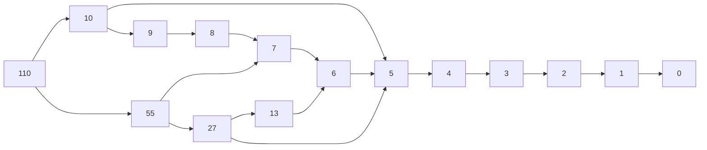

In our [previous blog post on shrinking](2022-08-26-pbt-shrinking-part1.html) we saw that we want to find  the simplest failing example we can in a shrinking tree. We had an initial example that failed our tests:

```kotlin
ItemSearchCriteria(
  ItemFilter(23, 110, 2022-01-01T00:00:00.000, setOf(Tag.clothes)),
  AgetItemOrder
)
```

To try to find simpler examples that may still be good examples of how our system fails, we decided to simplify the initial example, to _shrink_ it. To do so, we started by removing filters one by one. With this strategy we got a list of simplifications we could try and further simplify if we wanted.

Today we'll try to discuss how this intuititive idea of shrinking can be automated.

## Shrinking functions

Let's say our PBT library encodes generators of values of type `A` as an interface `Gen<A>`. In our example above, we would have a `Gen<ItemSearchCriteria>`. Such an interface would be something like:

```kotlin
interface Gen<A>{
  fun generateSample(seed: RandomSeed): A
}
```

Intuitevly we would like to also have Shrinkers, that we could define as a separate interface or as part of the `Gen` interface. In any case, they would provide a function that given a value of type `A` returns the list of possible first level shrinks:

```kotlin
fun shrinks(value: A): List<A>
```

The type of such a function would be:

```kotlin
type ShrinkFunction<A> = (A) -> List<A>
```

A shrinking function takes the value you want to shrink and returns a list of **_one-step_** shrinks from that value. 

The shrink function must return a list of values because there may be multiple different ways of shrinking the same value. In our example, when simplifying `ItemFilter` we could remove `minWeightInKgs`, `maxWeightInKgs`, `olderThan` or `hasAllTags` and each one gives us a different value..

On the other hand, it is important that the shrink function only returns different ways of slightly shrink a value, since the shrinking tree will be built by recursively applying the shrink function to a shrinks of the list when needed. In our example, when simplifying `ItemFilter` we don't need to remove combinations of more than one filter (like removing both `minWeightInKgs` and `maxWeightInKgs`) as that example will be obtained by further simplifying an example where we first removed just one filter.

## Shrinking simple types

Given such a definition, the PBT library can define shrink functions for some ubiquitous simple types like `Int` or  `Instant`{:.sidenote-number} _Unrelated: Because you know and use `Instant`, right? You know `DateTime` does not correctly represent when something happened but else what did the clocks somewhere in the world display when that happened, right?_{:.sidenote}.

An example naive implementation of `Int` shrinking may be:

```kotlin
fun intShrinks(value: Int): List<Int> =
    if (value == 0) emptyList()
    else if (value < 0) intShrinks(-value).map { -it }
    else listOfNotNull(
        if (value >= 20) sqrt(value.toDouble()).toInt() else null,
        if (value >= 10) value / 2 else null,
        if (value < 20) (value - 1) else null
    )
```

The value `110` would produce the following _shrinking tree_{:.sidenote-number} _Note this is a different shrinking function than the one I used in the previous post. If you noticed, sorry about that... and I'm frankly impressed you did._{:.sidenote}:



We can go as far as we want here. Depending on your use case, you could also simply rule that the only shrink of an `Int` value you want to try is `0`, simplifying things. But most of the time you can rely on the shrinking function provided by your PBT library and call it a day.

## Shrinking nullable types

Trying to generalize generic shrinks seems also easy for nullable types:

```kotlin
fun <A> shrinks(value: A?): List<A?> = listOf(null)
```

But, "Wait a minute!" - you say. - "Then, the shrinks for `55` of type `Int` are `listOf(7,27)` but the shrinks for 55 of type `Int?` are just `listOf(null)`?". And you are right, we are loosing the nice shrink function we already have for a type and not applying it to the nullable version of it. So let's try to generalize that to a type that already has a shrinking function:

```kotlin
fun <A> nullableShrinks(value: A?, notNullShrinks: (A) -> List<A>): List<A?> = 
  if (value == null) emptyList() 
  else listOf(null) + notNullShrinks(value)

fun nullableIntShrinks(value: Int?) = nullableShrinks(value, ::intShrinks)
````

That is, you can shrink the nullable value to null or either try to shrink it as you would if it weren't nullable.

### Divertimento: Playing with functions

Now that I already introduced a _high order function_ (nullableShrinks is a function that takes a function as a parameter) allow me to dig deeper. I can't help but do some functional programming here. You can skip this section if you are already tired of me selling this drug:

First let's redefine `nullableShrinks` to not only take a function as a parameter but to also return one. The idea is that it only takes the not null shrinking function (without the value to shrink) and it returns the shrinking function:

```kotlin
fun <A> nullableShrinks(notNullShrinks: (A) -> List<A>): <A> -> List<A?> = { a ->
  if (a == null) emptyList() else listOf(null) + notNullShrinks(a)
}
val nullableIntShrinks: (Int?) -> List<Int?> = nullableShrinks(::intShrink)
```

Oh! I forgot our nice type alias:

```kotlin
fun <A> nullableShrinks(notNullShrinks: ShrinkFunction<A>):
  ShrinkFunction<A?> = { a ->
  if (a == null) emptyList() else listOf(null) + notNullShrinks(a)
}
val nullableIntShrinks: ShrinkFunction<Int?> = nullableShrinks(::intShrink)
```

Furthermore, if you like Kotlin function receivers as much as I like them, you can define and use such shrink function as:

```kotlin
fun <A> ShrinkFunction<A>.nullable(): ShrinkFunction<A?> = { a ->
  if (a == null) emptyList() else listOf(null) + this(a)
}
val nullableIntShrinks = ::intShrink.nullable()
val nullableInstantShrinks = ::instantShrink.nullable()
```

## User provided shrink functions

And now, we can imagine ourselves, users of the PBT library, implementing shrink functions for our types:

```kotlin
val itemFilterShrinks: ShrinkFunction<ItemFilter> = { value ->
    listOf(
      value.copy(minWeightInKgs = null),
      value.copy(maxWeightInKgs = null),
      value.copy(olderThan = null),
      value.copy(hasAllTags = emptySet())
    )
}
```

But why not use the nice `nullableIntShrink` we just defined, instead of just trying `minWeightInKgs=null`? In fact, for each parameter we could try all the shrink values its shrink function provides. Assuming we also have an `instantShrinks`, we could do something like:

```kotlin
val itemFilterShrinks: ShrinkFunction<ItemFilter> = { value ->
    // Either shrink minWeightInKg
    ::intShrinks.nullable(value.minWeightInKgs).map { i -> 
      value.copy(minWeightInKgs = i) 
    } + // or maxWeightInKg...
    ::intShrinks.nullable(value.maxWeightInKgs).map { i -> 
      value.copy(maxWeightInKgs = i) 
    } + // or olderThan...
    instantShrink.nullable(value.olderThan).map { i ->
      value.copy(olderThan = i) 
    } + // or hasAllTags...
    listOf(value.copy(hasAllTags = emptySet()))
}
```

One way to understand this shrinking function is:

1. There are 4 options, the 4 fields you may shrink. We don't care about combinations of fields, as once shrinked a field, a subtree will try to shrink other fields not yet shrinked.
2. In the option of every field (e.g. `minWeightInKg`) there are as many possible shrinks as the field type shrinking function provides (e.g. `nullableIntShrink(value.minWeightInKgs)` for the `minWeightInKgs` field value).

## The problems with user provided shrink functions

Ok, we got this far. Nice! We can build shrink functions for all the types we use as test inputs. Isn't that a large amount of types? That probably is a large amount of types. Isn't it tedious? It is probably tedious. Is it error prone? It is indeed very error prone!

Let's look at these 2 problems in isolation:

### Bugs in our bug hunting toolset

{:.figcaption}

_Learn from the incredible shrinking man: A bug while playing with shrinking is much more dangerous!_{:.figcaption}

The user provided shrink functions are... functions, indeed. And they are code. And code has bugs. But these are an insidious type of bugs, as they only show when you are already trying to understand and fix a failing test that may be as well a bug. Yikes! So, in your happy path, you won't be running your shrink functions (neither in production nor in tests). They will run only when you have some test failure.

When I've found a bug in one of our shrink functions, it usually goes like this:

1. I get a PBT test failure and the example causing the failure is complex but the shrinking function does not work, so I get another complex example.
2. I groan. Oh no! Not now!
3. I try to get by without shrinking and try to understand the complex example that fails my test. 
4. If I do not despair:
    - 4.1. I fix whatever the test or the production code causing my original test failure
    - 4.2. I miserably fail to have the discipline to fix the shrink function. 
    - 4.3. Goto 1.
5. If I despair:
    - 5.1. I try to fix my shrinking function while my head is thinking about the actual test failure I try to fix.
    - 5.2. I finally manage to focus on fixing shrinking.
    - 5.3. Now I need to switch contexts again: Hopefully I have a seed and I can rerun my original failing test with the new shrink function and get a shrunk example I can use to fix whatever failed.

### Solving the buggy shrinkers problem

So, I know, I don't like bugs and I'm complaining like that was your fault. But, "hey, Jordi!" - you say - "good programmers write tests". And tests I write, indeed. But I want my shrinks to properly shrink whatever input I provide, and I'm not in the mood to be just writing examples and the shrinking I expect of them.

I'm leaving the mystery about how we test our shrinkers for a different post. Suffice to say that it is not easy. And, in case you want one spoiler, we don't test in isolation but integrated in the PBT library, that applies them repeatedly in search for the simplest example.

### Repetition, repetition, repetition

Let's think about our original example. In fact we wanted to simplify a value of type `ItemSearchCriteria`:

```kotlin
data class ItemSearchCriteria(val filter: ItemFilter, val order: ItemOrder)
```

So we need a shrink function for it too. But the strategy is exactly the same:

1. There are as many options as fields our data class has (2 for `ItemSearchCriteria`, 4 for `ItemFilter`). We don't care about combination of fields.
2. In the option of every field (e.g. `filter` for `ItemSearchCriteria` or `minWeightInKg` for `ItemFilter`), there are as many possible shrinks as the field type shrinking function provides.

So, assuming we also defined `itemOrderShrinks`:

```kotlin
val itemSearchCriteriaShrinks: ShrinkFunction<ItemSearchCriteria> = { value ->
    // Either shrink filter
    itemFilterShrinks(value.filter).map { f -> 
      value.copy(filter = f) 
    } + // or order...
    itemOrderShrinks(value.order).map { o -> 
      value.copy(order = o) 
    }
}
```

What a repetition, huh? If only we could generalize that and automate it...

### Automatic shrinking function derivation

Our shrinking functions heaven would be to automatically derive the shrinking functions our types need. For that we need a generic algorithm that is capable of returning a shrinking function for a given type (spoiler, it will take other shrinking functions as inputs). On top of that, some black magic may prove useful; something that, given the type we want to shrink (e.g. `ItemSearchCriteria`) automatically invokes such function and returns the shrink function. That could be based on introspection, macros... But my doctor says I'm not allowed to use black magic while programming; I seem to be allergic. So I prefer to compose generators using monads and have the shrinking function derived for me, as I'll show in the (hopefully near) future.

## Conclusions

1. Jordi can't explain shrinking in just 2 blog posts. He'll need like... what, 4 of them? More? In my defense I must say it is not a problem of the written language. When I talk I tend to spend hours to explain anything I'm passionate about, as well. It _could be_ related to my (not so great) knowledge of the English language; if that is the case I apologize, as I'm afraid I may be [smarter in catalan or spanish](https://www.youtube.com/watch?v=pltc5rtoskM).
2. Shrinking functions are promising... but this blog post leaves the reader with a sense of unsafety. Is all this effort worth it? Will we be able to use shrinking or even property based testing without spending lots of hours in doing so? Will the benefit overcome the costs? Many teams I worked with weren't sure it wouldn't pay off until they started using property based testing with a proper shrinking infrastructure... and they loved it. So, please, keep reading this series. I'll try my best to keep writing them. 
3. If you were expecting some more seriousness in the conclusions I'm sorry to disapoint you. I was in the mood for some more jokes. But please, do complain via Twitter.  After all, you went far enough to be reading the last few words of the article, so you deserve my apologies.

