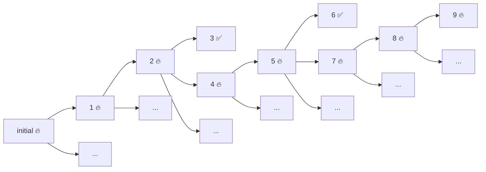
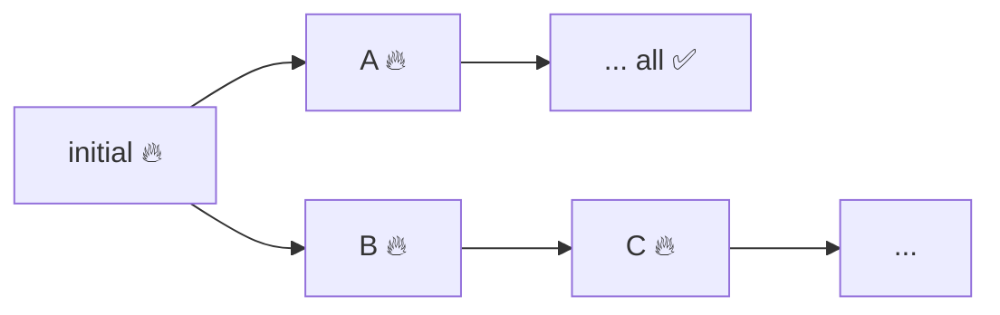

In our previous blog post on shrinking we saw that we need to find for the simplest failing example we can in a shrinking tree. We had this example:



So we want our PBT library to search a tree like this looking for the simplest example that still fails. But it is not as simple as it sounds...

### When to stop searching?

To begin with, the shrinking tree of any non-trivial example will be huge. Therefore, we can't simply search all the nodes in the tree. We need some prunning. 

One usual strategy is to return the last failing example once we find an example that passes the build. Unfortunately, in our example that would give us example :two: `ItemSearchCriteria(ItemFilter(null, 110, 2022-01-01T00:00:00.000, setOf(Tag.clothes, Tag.exclusive)), Indifferent)`, which is far from the simplest example we may find. 

Other, smarter, strategies are possible. We can look afer an example that fails and can't be shrinked further, like :nine: above. But we may find that a shrinkeable example fails but every possible shrinking we attempt passes the tests. In such cases, we can finish searching too, but we may end up with an example that is a local min, like _A below_{:.sidenote-number} _We can't find simpler examples than A in its path, but C is simpler (and may be even further shrinkable)._{:.sidenote}:



In my opinion, the best strategy is to keep searching, even when an example has all its shrinks pass the test, until some condition. It may be a maximum number of examples attempted or, even better, the maximum amount of time devoted to shrinking. But none of the PBT libraries I know implement such strategy out of the box.

### What's the size of an example? Which one is _simpler_?

The strategy mentioned above opens another question: Which of the failing examples found so far is simpler? We are assuming example `C` above is simpler than `A` because, from the initial failing value, `C` was obtained applying 2 shrinks while `A` required just one. But there may be other responses to this question.

### How do we get simpler examples?

In this particular example we want to simplify a value of type `ItemSearchCriteria` and  we have seen there are multiple ways of simplifying it, like the two we attempted from example :five: above. How does the PBT library how to simplify any type `A` created by the user?

One possible aproach is having the user program the shrinking function for the generators she uses:

```kotlin
type ShrinkFunction<A> = (A) -> List<A>
```


​	

### 
