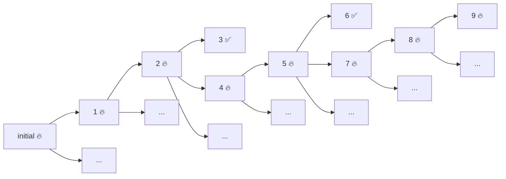
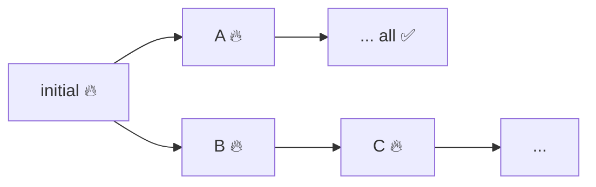

Back on 2022 I wrote about Property Based Testing shrinking. In [the first post of the series](/2022-08-26-pbt-shrinking-part1.html) I introduced the concept of shrinking. Once our Property Based Test fails, we want a simplified example of the provided inputs ([and state](/2022-06-17-testing-and-persistent-state.html)) that still detects the bug, removing as much complexity as we can from the randomly generated value that actually found the bug. Then, in the [second post of the series](/2022-09-13-pbt-shrinking-part2.html), we saw how a srhinking function of type `type ShrinkFunction<A> = (A) -> List<A>` may allow us to automate the generation of such a tree.

In the firtst post we saw an example of the _manual_ shrinking of `ItemSearchCriteria  that gave us a search tree like:



Where:

1️⃣ 🔥 was: 

```kotlin
ItemSearchCriteria(ItemFilter(23, 110, 2022-01-01T00:00:00.000, setOf(Tag.clothes, Tag.exclusive)), Indifferent)
```

2️⃣ 🔥 was:

```kotlin
ItemSearchCriteria(ItemFilter(null, 110, 2022-01-01T00:00:00.000, setOf(Tag.clothes, Tag.exclusive)), Indifferent)
```

3️⃣ ✅ was:

```kotlin
ItemSearchCriteria(ItemFilter(null, null, 2022-01-01T00:00:00.000, setOf(Tag.clothes, Tag.exclusive)), Indifferent)
```

4️⃣ 🔥 was:

```kotlin
ItemSearchCriteria(ItemFilter(null, 110, null, setOf(Tag.clothes, Tag.exclusive)), Indifferent)
```

5️⃣ 🔥 was:


```kotlin
ItemSearchCriteria(ItemFilter(null, 110, null, emptySet()), Indifferent)
```

6️⃣ ✅ was:

```kotlin
ItemSearchCriteria(ItemFilter(null, null, null, emptySet()), Indifferent)
```

And  7️⃣🔥, 8️⃣🔥 and 9️⃣🔥 shrinked the value 110 from 5️⃣ to 100, 50 and 0 to get:

```kotlin
ItemSearchCriteria(ItemFilter(null, 0, null, emptySet()), Indifferent)
```

### The immensity of (the problem) space

If we are to automate the search of the simplest example still failing our test, one ideal situation would be to traverse **all of** the shrinking tree and return the simplest solution in it. But there is one problem. For any non-trivial shrinking function, if we are not lucky enough, the tree can be too big. Our shrinking function may take forever.

So we need to know...

## When to stop searching?

Some libraries take the approach to return the last failing example once they find an example that passes the build. Unfortunately, in our example that would give us example 2️⃣, as that is the last failing example we find before a successful one (3️⃣). That example corresponded to `ItemSearchCriteria(ItemFilter(null, 110, 2022-01-01T00:00:00.000, setOf(Tag.clothes, Tag.exclusive)), Indifferent)`, which is far from the simplest example we may find. 

Other, smarter, strategies are possible. We can look after an example that fails and can't be shrinked further, like :nine: above. But we may find that a shrinkeable example fails but every possible shrinking we attempt passes the tests. In such cases, we can finish searching too, but we may end up with an example that is a local min, like _A below_{:.sidenote-number} _We can't find simpler examples than A in its path, but C is simpler (and may be even further shrinkable)._{:.sidenote}:



In my opinion, the best strategy is to keep searching, even when an example has all its shrinks pass the test, until some condition. It may be a maximum number of examples attempted or, even better, the _maximum amount of time devoted to shrinking_{:.sidenote-number}: _None of the Kotlin or Scala property based testing libraries I know implements an strategy like that. But we have successfully implemented one on top of [kotest](https://kotest.io/) by rewriting an important part of their engine._{:.sidenote}

```kotlin
testAll(itemSearchCriteriaArb, shrinkUntil = StopCondition.after(3.minutes)) { 
  searchCriteria ->
    val result = searchItems(searchCriteria)
    val failingResults = result.filter { it.matches(searchCriteria.filter) }
    assertEquals(emptySet(), failingResults.toSet())
}
```

### What's the size of an example? Which one is _simpler_?

The strategy mentioned above opens another question: Which of the failing examples found so far is simpler? 

We used the depth in the tree as an answer: we assume example `C` above is simpler than `A` because, from the initial failing value, `C` was obtained applying 2 shrinks while `A` required just one. Although there may be other responses to this question, we have found that one to work quite well in real-world application.


**TODO**: Already explained in previous articles:

## Shrinking in PBT libraries

The intuitive idea of shrinking consists of reducing the _size_ of a value. Let's take the set of tags we want to use to filter items: `Set(Tag.clothes, Tag.exclusive)`. We could shrink it by removing elements from the set. Acording to this idea, `setOf(Tag.clothes)` would be intuitively one step smaller than the original value, as it would be `setOf(Tag.exclusive)`. If any of those simpler values still failed the test, we could shrink further by taking `emptySet()`, which would be 2 _steps_ smaller than the original value.

For the library to be able to shrink values of some type `T`, it needs some function that allows us to shrink a value of type `T`. Like it happens with the example above, there may be more than one way to shrink such a value. The `ItemFilter` type, for example, may be shrinked by shrinking `minWeightInKgs`, `maxWeightInKgs`, `olderThan` or `hasAllTags`. At the same time, there may be multiple ways to shrink each of these components.

Therefore, the shrinking function should be a function from `T` to a `List` of possible one-step shrinkings of T. For each of these shrinked values, we can apply the shrinking function to get a new List of possible two-step shrinkings. The recursive application of the shrinking function gives us a (potentially very large) shrinking tree.


Therefore, there is a way of attaching a shrinking function to a generator:

```kotlin
fun <A> Arb<A>.shrinkingTo(f: (A) -> List<A>) =
  arbitrary(Shrinker { value -> f(value) }) { this@shrinkingTo.bind() }
```

Whenever a test fails with some sample, the process of shrinking, consists of traversing the shrinking tree generated by the recursive application of the shrinking function on the value, in a depth-first order, trying to find the most shrinked (deepest) value in the tree that still fails the test. For that purpose, the test is run with values in the shrinking tres.

### Small detour: On generators ` map` function and the shrinking function

A generator of values of type `T`, usually called `Gen<T>`, has a functor, meaning that you can `map` it with a pure function to return a generator of a new type. e.g. For a generator `g` of type `Gen<Int>`, `g.map{it.toString()}` returns a generator of type `Gen<String>` that generates strings that represent integer numbers.

Let's say a generator `Gen<T>` has been provided with a shrinking function  (e.g.: a shrinking function `(Int) => List<Int>`). Now, we can `map` our generator to another type `R`and we would like to keep the shrinking function we already had. In the `Int` example, imagine the shrinking function was `(value:Int) => {listOf(max(0,value-1))}`. How can we calculate the mapped shrinking function of type `(String) => List<String>`? We can't. We would need to convert the input `String` into an `Int` to be able to apply the `Int` shrinking funciton we had.

Kotest resolves this applying a neat trick: You can attach a shrinking function to a generator, but, internally, the generator always generates a value with the (lazy) tree of shrinked values:

```kotlin
data class Sample<out A>(val value: A, val shrinks: RTree<A> = RTree({ value }))
data class RTree<out A>(val value: () -> A, val children: Lazy<List<RTree<A>>> = lazy { emptyList<RTree<A>>() })
```

Note: I think `Sample.value` is unnecessarily repeated here, as `Sample.shrinks.value()` holds the same value and it may be evaluated eagerly.

How does that change our problem? Now, for any given `Gen<A>` you can `map` with a function `f: (A) => B` and get a generator that generates instances of `Sample<B>` by just generating a `Sample<A>` and mapping its value and all of its shrinking tree with `f`.


## Generalizing shrinking

- TODO: ADTs: Union types + product types
