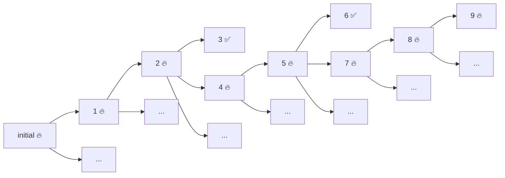

As you may already know, Property Based Testing (PBT) is an automated testing technique where you test properties of your programs or functions instead of testing particular examples like we do in classical unit testing. A PBT library allows you to program properties (e.g. "for all integers `i` such that `i != 0`, `0 / i = 0`") and generators of values that generate random valid examples (e.g. a generator of integers `i` such that `i != 0`). It then checks that your programa abides by the property you defined for _many_{:.sidenote-number} _How many are "many examples"? This is a matter of a different post._{:.sidenote} generated random examples, assuming that if no counter-example is found after a number of attempts bigger enough, the property is true. Such properties can be written as tests that, instead of hard-coded examples, use randomly generated inputs (and [initial state](2022-05-27-what-is-an-automated-test-again.html)); we will say a property holds for a given example if the test doesn't fail. 

In this article I will focus on what happens when the property does not hold and an example is found that fails the test. In traditional automated testing, we only need to know which of our test scenarios failed an assertion (and which one), as the test has hard-coded examples we can reason about. But in PBT, beyond the property that failed and assertion, we may need to know what particular counter-example was found. Unfortunately, that randomly generated example may be very complex and there may be simpler values that also fail the test. Shrinking is a feature of property based testing libraries that tries to find such a simpler failing value.

## Example: searching for items

Let's say you have items in some repository represented here as a _the function `searchItems`_{:.sidenote-number} _For the sake of simplification we will assume this repository has a fixed, hardcoded state, a number of hardcoded items so it can be represented as a pure function and we don't have to [deal with state](2022-06-17-testing-and-persistent-state.html)._{:.sidenote}:

```kotlin
data class Tag(val value: String)
data class Item(
  val id: String, 
  val weightInKgs: Int, 
  val createdAt: Instant, 
  val tags: Set<Tag>
)

suspend fun searchItems(criteria: ItemSearchCriteria): List<Item> = notShown()    
data class ItemSearchCriteria(val filter: ItemFilter, val order: ItemOrder)
data class ItemFilter(
  val minWeightInKgs: Int?, 
  val maxWeightInKgs: Int?, 
  val olderThan: Instant?, 
  val hasAllTags: Set<Tag> = emptySet()
)
interface ItemOrder {
    companion object{
        object Indifferent: ItemOrder
        object Age: ItemOrder
        object Weight: ItemOrder
    }
}

```

And let's say you have a property such that:

```kotlin
fun Item.matches(filter: ItemFilter): Boolean =
  (filter.minWeightInKgs?.let { this.weightInKgs >= it } ?: true) &&
  (filter.maxWeightInKgs?.let { this.weightInKgs <= it } ?: true) &&
  (filter.olderThan?.let { this.createdAt < it } ?: true) &&
  this.tags.containsAll(filter.hasAllTags)

testAll(itemSearchCriteriaArb) { searchCriteria ->
  val result = searchItems(searchCriteria)
  val failingResults = result.filter { it.matches(searchCriteria.filter) }
  assertEquals(emptySet(), failingResults.toSet())
}
```

Assume we get a failing test with the following sample, for which our function returns items with weight above `110`.

```kotlin
ItemSearchCriteria(ItemFilter(23, 110, 2022-01-01T00:00:00.000, setOf(Tag.clothes, Tag.exclusive)), AgetItemOrder)
```

Now you know that the `searchItem` function is not behaving correctly with this particular example. Imagine there is a bug in the filter by `maxWeightInKg` that, by mistake, filters by the reverse condition in your implementation, but, of course, the developers are unaware of it.

## Manually bug hunting


{:.figcaption}

In our example, we found a test that fails when the randomly search criteria are the ones shown above. Let the game begin!

Of course we may notice that the returned items all have a weight above 110 and we would be done. But that may be difficult to realize. Imagine your search returns hundreds or thousands of items and that each item, instead of a blog example is a complex entity. Now you are probably facing a daunting screen of thousands of lines printing the returned examples and it is difficult to see what of the filters they fail to satisfy.

The problem is that the example for which we got a failure is way too complex. We have (potentially) a lot of distracting values that don't matter for the bug at hand. Knowing what the bug is, you and me know that it doesn't matter wether you filter by `olderThan` or not. Knowing what the bug is, if I asked you, a wonderful and smart human being, what the simplest counter-example is, you would probably give me something like `ItemSearchCriteria(ItemFilter(null, 0, null, emptySet()), Indifferent)`.

You are indeed smart... but, out there, you don't know what the bug is in advance. So let's try to simplify the example bit by bit.

## Shrinking the failing example

Looking at the problem at hand and assuming I don't have any clue about what is failing, I'd try to remove criteria I _think_ won't affect filtering. So, let's try telling our function we don't care about sorting:

```kotlin
ItemSearchCriteria(ItemFilter(23, 110, 2022-01-01T00:00:00.000, setOf(Tag.clothes, Tag.exclusive)), Indifferent)
```

1️⃣ 🔥 A failure. And now we have a simpler example, one with less distracting values.

Now I'd try removing filters one by one. Let's go left to right:

```kotlin
ItemSearchCriteria(ItemFilter(null, 110, 2022-01-01T00:00:00.000, setOf(Tag.clothes, Tag.exclusive)), Indifferent)
```

2️⃣ 🔥Ok, it still fails. So far so good, it seems that the sorting and min weight aren't unrelated to the problem.

Let's go for `maxWeightInKgs`:

```kotlin
ItemSearchCriteria(ItemFilter(null, null, 2022-01-01T00:00:00.000, setOf(Tag.clothes, Tag.exclusive)), Indifferent)
```


{:.figcaption}

3️⃣ ✅ Woa! That one passes the tests! This is already a very good hint! We may have a bug in `maxWeightInKgs`. But what about the other filters? Are they related to the failure? Our example is still not as nice as the one we know we want if we know where the bug is. At the same time, as this example didn't fail, I wouldn't probably keep shrinking it. In other terms, setting `maxWeightInKgs` to `null` opens a path (that would admit more simplifications) where our bug is not manifested. These are not the examples we are looking for. 

But we can try to keep simplifying 2️⃣ to check wether `olderThan` and `hasAllTags` are unrelated. So, let's try to remove `olderThan`:

```kotlin
ItemSearchCriteria(ItemFilter(null, 110, null, setOf(Tag.clothes, Tag.exclusive)), Indifferent)
```

4️⃣ 🔥 Ok, it keeps failing. `olderThan` seems unrelated to our failure. 


```kotlin
ItemSearchCriteria(ItemFilter(null, 110, null, emptySet()), Indifferent)
```

5️⃣ 🔥 `hasAllTags` seems unrealted to the failure too.

What about going one step further? 

```kotlin
ItemSearchCriteria(ItemFilter(null, null, null, emptySet()), Indifferent)
```
6️⃣ ✅ The test now succeeds. `maxWeightInKgs` definetively seems the cause of our trouble.

So the simplest example we've got so far is example 5️⃣. But we can play this game even further. Do we have a problem with the number `110`? Or any number would fail? As humans, round decimal numbers and numbers closer to 0 seem simpler, so we could keep shrinking this example to test for `maxWeightInKgs` `100` 7️⃣, `50` 8️⃣, `0` 9️⃣ and it would still fail. So we got:

```kotlin
ItemSearchCriteria(ItemFilter(null, 0, null, emptySet()), Indifferent)
```

Assuming 0 is the simplest value for the `maxWeightInKgs`filter (other than null), the example we have can't be further simplified.

Now, that's a nice example to use to try to understand our bug!

## Traversing the shrinking tree

If we think carefully at what we just did we can see we are doing a search in a _tree of simplifications_{:.sidenote-number} _Here 🔥 means the example fails the test and ✅ means the example passes the test._{:.sidenote}:



We did this more or less by hand. But, hey, there is a reason they taught you how to traverse a graph! Computers like to do this kind of stuff and they excel at it!! Why don't ask our fancy open source PBT library to shrink for us?

## Conclusions

We have seen how property based testing gives us complex examples of inputs for which our program doesn't satisfy the property we expect it to. Once we have one such example it may be difficult to diagnose what the bug was. One strategy we may use is to simplify or shrink our example to get simpler examples that still fail. That can be useful to reason about what is failing but also to debug our program with less distracting inputs, for example.

In the next post in the series we'll discuss how a property based testing library can automate this shrinking and what are the difficulties of doing so.

## All the articles in the series

1. [Property based testing: Shrinking (part 1)](./2022-08-26-pbt-shrinking-part1.html)
2. [Property based testing: Shrinking (part 2) - Shrinking functions](./2022-09-13-pbt-shrinking-part2.html)

