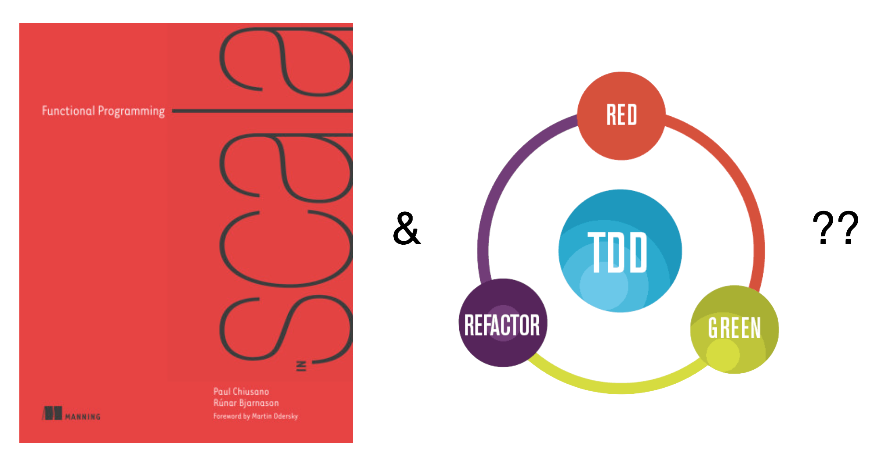

---

layout: post
title: >- 
  Writing a Parser Combinator Library in Scala 3.<br>
  Part 1: Introduction to Parsing
author: Jordi Pradel
categories: [scala,parsers,design,fp,tdd,testing]
description: >-
  In this article we start writing a Parser Combinator Library in Scala 3 from scratch. But instead of using an algebraic design approach, like the Red book does, we will use a Json parser as an example of such parser and we will apply TDD while designing such parser.
---

You know I like to write libraries from scratch. I find this to be a longer but better kata, where you implement something you could actually use. And, who knows, after the zombie apocalypse, once we recover from everything else, you may need a parsers library and all the good old ones are gone forever. So, let's survive the apocalypse by writing one ourselves.

To do so I'll use the perfect excuse. I want to write yet another Json parser. I want it to be reasonable fast but, above everything else, I want it to be crystal clear when it comes to report errors. At least as good as  those of most Json parsers I use, or better. Because if we are going to write a library from scracth let's make it professional grade at least in one aspect.

## Disclaimer 1: Scala 3 and my experience with it (or lack of thereof)

This time I'll use Scala. I've been blogging about Kotlin recently but I've been a Scala developer for years and I use both now. And I'll be writing Scala 3 for the first time (not counting some small divertimentos), so be patient and kind if something I write is not completely idiomatic in Scala 3 or if the library we end up with does not take advantage of every single Scala 3 wonderful new feature.

## Disclaimer 2: Inspiration and destination

Ok, I'll admit it up front. I will end up writing a parser combinator library. And it so happens that the language (Scala) and example (Json) I have chosen are the same the famous [Red book](https://www.manning.com/books/functional-programming-in-scala) uses. Why write about it, then, if you can read [Paul Chiusano](https://twitter.com/pchiusano) and [Runar Bjarnason](https://twitter.com/runarorama)? First of all, no matter what, you must read the red book _if you haven't yet_{:.sidenote-number}_You probably can read it again if you already have and you will probably still learn a ton of things._{:.sidenote}.  But I'll try my best at a different approach to the parser combinator library. Instead of applying algebraic design, I'll use a classical TDD approach.



There are a couple of points I'd like to make with this:

- You can design something like parser combinators using TDD; algebraic design is just one way, not the only way. Applying TDD like I'll do is not without drawbacks but it may work for you.
- You don't need to know obscure mathematics and the terrible M word to design a parser combinator library. Or, to put it another way, monads are not your enemy and they aren't something you should be afraid of... when they excel at the job at hand. You may have ended designing a similar solution without being a fan of monads. What is more, you may have designed a much less elegant solution if you were to design it from scracth without monads.

## Parsing what? 

Let's parse [Json](https://json.org). For that, let's write a Json type:

```scala
enum Json:
  case JsonString(value: String)
  case JsonNumber(value: String)
  case JsonBoolean(value: Boolean)
  case JsonNull
  case JsonArray(value: List[Json])
  case JsonObject(value: Map[String, Json])
```

You may think `JsonNumber(value: String)` is an odd choice. I'll talk about this in the future. Trust me with that one. But in any case, for the matter of this series, it doesn't matter that much if you prefer to model them as `JsonNumber(value: Double)` or something else.

Done. Now the parser...

## What is a parser?

Let me try to answer this question with some requirements...

Let's start by just parsing something simple, like an empty array. Acording to [json.org](https://json.org) an array is:


Here `whitespace` represents any number of whitespace characters. It may be the empty string.

So, setting aside the parsing of values inside the array, we want a function that given the `String` `"[ ]"` returns `JsonArray(List.empty)` (for any number and type of whitespace characters between the brackets). 

Let's do it TDD style:

```scala
test("Parse empty array") {
  assert(parseArray("[]") == JsonArray(List.empty))
}
```

🔴 Red. Easy peasy:

```scala
object JsonParser:
  def parseArray(s: String): JsonArray = JsonArray(List.empty)
```

✅ Green!

Let's delay the implementation of whitespace. What else do we need? Here is what: What do we want the parser to do if feeded only with `"["`? We expect it to fail. The failure should tell us where it failed and what was expected. That is, we failed at the second character (`s[1]`) where we expected `]` but we found the end of the string.

We can deal with errors with exceptions, with `Try`, with `Either` or with a custom type. Let's try using `Either`:

```scala
test("Parse empty array") {
  assert(parseArray("[]") == Right(JsonArray(List.empty)))
}

test("Parse empty array failure") {
  val input = "["
  assert(parseArray(input) == Left(ParseError(input, 1, expected = "]")))
}
```

🔴 It does not even compile. Let's create the `ParseError` class and change the `parseArray` signature:

```scala
case class ParseError(input: String, position: Int, expected: String)

object JsonParser:
  def parseArray(s: String): Either[ParseError, JsonArray] = Right(JsonArray(List.empty))
```

🔴 It now compiles but...

```bash
Right(JsonArray(List())) did not equal Left(ParseError("[", 1, "]"))
ScalaTestFailureLocation: com.agilogy.wapl.JsonParserTest at (JsonParserTest.scala:17)
Expected :Left(ParseError("[", 1, "]"))
Actual   :Right(JsonArray(List()))
```

Now what? We could [DTSTTCPW](http://wiki.c2.com/?DoTheSimplestThingThatCouldPossiblyWork=) and just implement `parseArray` to return this particular error when the input string is `"["`. But this is not a _bad TDD training_{:.sidenote-number} _Just in case: I'm not saying TDD is bad at all, of course. Neither I'm saying training people in TDD with really small steps is bad. I'm just making a joke about confusing baby steps with implementing each test case with an if/else branch. Even though I'm making a bit of a pun to code without designing, which should be the opposite of TDD._{:.sidenote}. So let's think a bit and design a solution.

Looking at the json.org diagram above, we see `[` and `]` are different nodes in the grammar chart. Maybe our mission of parsing just the empty array was [more than we can chew](https://www.youtube.com/watch?v=U_-nHeIenBM) now, afer all. Let's try something simpler. Let's try to parse the `[` token. So let's `git stash save wip` or comment out our _failing test_{:.sidenote-number} _We are doing TDD right, no? And we are in the midle of a red. So let's go back to green, make an increment, and we will retake what we where doing when in green again._{:.sidenote}and start anew. Parsing a token, when it succeeds, can only do so **in one way**. When succeeding, therefore, we only need the `Unit` value as a return:

```scala
test("Parse start array token") {
  assert(parseStartArrayToken("[") == Right(()))
}

test("Parse start array token failure") {
  val input = "notTheStartArrayToken"
  assert(parseStartArrayToken(input) == Left(ParseError(input, 0, expected = "[")))
}
```

🔴 Does not compile. Let's go directly to green:

```scala
def parseStartArrayToken(s: String): Either[ParseError, Unit] =
	if (s == "[") Right(()) else Left(ParseError(s, 0, "["))
```

✅ Now refactor ♻️. You see, I'm going to try to parse the `]` token. So it seems we are going to parse tokens in general. Let's refactor that:

```scala
def parseToken(s: String, token: String): Either[ParseError, Unit] =
  if (s == token) Right(()) else Left(ParseError(s, 0, token))
```

Mmmm... 🤔 I prefer the token to be the first argument... and the string to be a second argument list:

```scala
def parseToken(token: String)(s: String): Either[ParseError, Unit] = ...
```

And our tests are now:

```scala
test("Parse token") {
  assert(parseToken("[")("[") == Right(()))
}

test("Parse token failure") {
  val input = "notTheStartArrayToken"
  assert(parseToken("[")(input) == Left(ParseError(input, 0, expected = "[")))
}
```

Great!

Now we want to parse the token `[` and then the token `]`. That's the question. And here is a simple idea: we want our token parser to be able to parse any string that starts with that token:

```scala
def parseToken(token: String)(s: String): Either[ParseError, Unit] =
  if (s.startsWith(token)) Right(()) else Left(ParseError(s, 0, token))
```

After parsing `[` in `"[]"` we now know that the string starts with `[` and that we can continue to parse `]`... **after the [**. I could play with our current design like this:

```scala
def parseArray(s: String): Either[ParseError, JsonArray] =
  parseToken("[")(s) match
    case Right(()) =>
      parseToken("]")(s.substring(1)) match {
        case Right(()) => Right(JsonArray(List.empty))
        case Left(e) => Left(e)
      }
    case Left(e) => Left(e)
```

Or, ~~monadically~~ <ins>idiomatically</ins>:

```scala
def parseArray(s: String): Either[ParseError, JsonArray] =
  for
    _ <- parseToken("[")(s)
    _ <- parseToken("]")(s.substring(1))
  yield JsonArray(List.empty)
```

✅! But if you now `git stash pop` or uncomment our `"Parse empty array failure"` test:

```scala
test("Parse empty array failure") {
  val input = "["
  assert(parseArray(input) == Left(ParseError(input, 1, expected = "]")))
}
```

🔴 The test fails:

```bash
Left(ParseError("", 0, "]")) did not equal Left(ParseError("[", 1, "]"))
ScalaTestFailureLocation: com.agilogy.wapl.JsonParserTest at (JsonParserTest.scala:17)
Expected :Left(ParseError("[", 1, "]"))
Actual   :Left(ParseError("", 0, "]"))
```

So, the parser correctly fails to parse, but it is telling us that it expected `"]"` at position 0 (where we have `"["`) instead of telling us it expected it at position 1. And it tells us the string that failed to compile is `""` when it should complain about the actual string it got: `"["`. Why? As we passed the `substring(1)` to the second `parseToken`, the `input` and `position` values of the resulting error are wrong. We want the error to contain the entire string and the position to be a position of that string, so we will need them in our `parseArray` function. And once we have the original input and the position we want to parse at, we no longer need the substring. _We can simply check whether the string starts with the token at that index:_{:.sidenote-number}_Yes, there is a version of `startsWith` that takes an index. No, I didn't know either._{:.sidenote}

```scala
def parseToken(token: String)(s: String, position: Int): Either[ParseError, Unit] =
  if (s.startsWith(token, position)) Right(()) else Left(ParseError(s, position, token))
```
So now:
```scala
def parseArray(s: String): Either[ParseError, JsonArray] =
  for
    _ <- parseToken("[")(s, 0)
    _ <- parseToken("]")(s, 1)
  yield JsonArray(List.empty)
```

And after fixing the compilation errors of adding a new parameter... ✅ Green!

 🤔 Do you remember what this section was about? The question was: "What is a parser"? Looking at our `parseToken` we have _one possible answer_{:.sidenote-number}_Mind the gap. We will refine this answer later in the series._{:.sidenote} now: A parser is a function that given a `String` input and a position in that string either returns a parsed value (like the empty array above) or a parse failure:

```scala
type Parser[A] = (String, Int) => Either[ParseError, A]
```

♻️ We ended our previous TDD cycle with green. A refactor is due. But what are we going to refactor? 🤔

With that definition you don't even need to squint too hard to see that `parseToken` can be seen as a function that given a `String` (the token) returns a parser:

```scala
def parseToken(token: String): Parser[Unit] = (s, position) =>
  if (s.startsWith(token, position)) Right(()) else Left(ParseError(s, position, token))
```

As `parseToken` it is no longer parsing any token but returning a parser of strings, maybe we better call it `string`:

```scala
def string(token: String): Parser[Unit] = (s, position) =>
  if (s.startsWith(token, position)) Right(()) else Left(ParseError(s, position, token))
```

Now, why not make our `parseArray` a parser too?

```scala
def parseArray(): Parser[JsonArray] = (s, position) =>
  for
    _ <- string("[")(s, position)
    _ <- string("]")(s, position + 1)
  yield JsonArray(List.empty)
```

And as it is not taking arguments, why not make it a value?:

```scala
object JsonParser:
  val array: Parser[JsonArray] = (s, position) =>
    for
      _ <- string("[")(s, position)
      _ <- string("]")(s, position + 1)
    yield JsonArray(List.empty)

```

And our tests:

```scala
test("Parse empty array") {
  assert(array("[]", 0) == Right(JsonArray(List.empty)))
}

test("Parse empty array failure") {
  val input = "["
  assert(array(input, 0) == Left(ParseError(input, 1, expected = "]")))
}
```

## Combining parsers

Let's now imagine you want to accept the next kind of empty arrays. Those with some whitespace within. 

```scala
private val random = new Random()

test("Parse empty array with whitespace") {
  val ws = " " * random.between(1, 5)
  assert(array(s"[$ws]", 0) == Right(JsonArray(List.empty)))
}
```

🔴:

```bash
Left(ParseError("[  ]", 1, "]")) did not equal Right(JsonArray(List()))
ScalaTestFailureLocation: com.agilogy.wapl.JsonParserTest at (JsonParserTest.scala:21)
Expected :Right(JsonArray(List()))
Actual   :Left(ParseError("[  ]", 1, "]"))
```

We will need a parser for `whitespace`. 


Acording to the Json grammar this should parse 0 or more whitespace characters. It can't fail. If our string starts with whitespace in the given index, it succeeds. If it doesn't it also succeeds. So we don't even need tests for that one. Which is already suspicious. We may be missing something....

```scala
val whitespace: Parser[Unit] = (_, _) => Right(())
```

Let's try now to rewrite our array parser:

```scala
val array: Parser[JsonArray] = (s, position) =>
  for
    _ <- string("[")(s, position)
    _ <- whitespace(s, position + 1)
    _ <- string("]")(s, ???)
  yield JsonArray(List.empty)
```

And here it is. The bit we were missing. After parsing some whitespace we need to know how many whitespace characters there were. We could solve that one _ad hoc_ by stating that `whitespace` is a `Parser[Int]`, which returns the number of whitespace characters it found:

```scala
private val whiteSpaceChars = Set(' ', '\n', '\r', '\t')

val whitespace: Parser[Int] = (s, position) =>
  Right(s.substring(position).takeWhile(c => whiteSpaceChars.contains(c)).length)

val array: Parser[JsonArray] = (s, position) =>
  for
    _ <- string("[")(s, position)
    whiteSpaceCount <- whitespace(s, position + 1)
    _ <- string("]")(s, position + 1 + whiteSpaceCount)
  yield JsonArray(List.empty)
```

✅! 

♻️ I start to be fed up with the position arithmetics in our `array` parser. In the second step of our for comprehension we pass `position + 1` because what the first step parsed occupies 1 character. Then in the third step we pass `position + 1 + whitesSpaceCount` because the previous 2 steps parsed `1 + whitesSpaceCount` characters. Every step needs to add the number of parsed characters by the previous steps. It is not nice. What about our steps all returned the position at which they stopped parsing?

```scala
val whitespace: Parser[Int] = (s, position) =>
  Right(position + s.substring(position).takeWhile(c => whiteSpaceChars.contains(c)).length)

val array: Parser[JsonArray] = (s, position) =>
  for
    i0 <- string("[")(s, position)
    i1 <- whitespace(s, i0)
    _ <- string("]")(s, i1)
  yield JsonArray(List.empty)

def string(token: String): Parser[Int] = (s, position) =>
  if (s.startsWith(token, position)) Right(position + token.length) 
	else Left(ParseError(s, position, token))
```

Much better! Now I need to remember which one of the `i{n}` variables to pass, but I don't need to be calculating the next position to pass by hand. And after some adjusting of the expected result of parsing in the tests we are still green.

And now, try to honor _this section name_{:.sidenote-number} _It seems to be a recurrent theme. I name a section "X" and then I spend lines and more lines without any mention to "X", until I remember what I was talking about. Sorry not sorry. 😙_{:.sidenote}. Our `array` parser is combining the `parseToken("[")`, `whitespace` and `parseToken("]")` parsers by hand. That is, it is implementing a parser that, given the string and the position, uses those parsers. But we could just build the new parser by combining the existing parsers before we actually run the parser. Let's first forget about the whitespace for a moment:

```scala
val array: Parser[JsonArray] = (s, position) =>
  for
    i0 <- string("[")(s, position)
    _ <- string("]")(s, i0)
  yield JsonArray(List.empty)
```

I'm proposing a function that given 2 parsers (namely `string("[")` and  `string("]")` ) returns a parser that internally does what the code above does:

```scala
def sequence(a: Parser[Int], b: Parser[Int]): Parser[Int] = ???
```

As all our parsers here return the position after parsing what they parse, I'm assuming we want to sequence this kind of parsers. And I'm assuming we want to return the position after parsing the combination:

```scala
def sequence(a: Parser[Int], b: Parser[Int]): Parser[Int] = (s, position) =>
  for
    ia <- a(s, position)
    ib <- b(s, ia)
  yield ib
```

And now, our simplified `array` parser without whitespaces is:

```scala
val array: Parser[JsonArray] = 
  sequence(string("["), string("]"))
```

🔴 Ops! That does not compile. We have a parser that returns `Int` but we need a `JsonArray`. So let's fix that:

```scala
val array: Parser[JsonArray] = (s, position) =>
  for
    _ <- sequence(string("["), string("]"))(s, position)
  yield JsonArray(List.empty)
```

Or, if you prefer:

```scala
val array: Parser[JsonArray] = (s, position) =>
  sequence(string("["), string("]"))(s, position)
		.map(_ => JsonArray(List.empty))
```

✅ (except our whitespace test, of course)

But before recovering our whitespace, let's dig a bit deeper in this idea. We tried to combine the parsers to get a parser before actually running the resulting parser. Let's say we apply the same idea to that `.map`. We may want to be able to transform the parser we got by combining `parseToken("[")` and  `parseToken("]")`, which was a `Parser[Int]` by transforming it into a `Parser[JsonArray]`. We need a function... let's call it `map`, of course:

```scala
def map[A,B](p: Parser[A])(f: A => B): Parser[B] = (s, position) =>
  p(s, position).map(f)
```

And now:

```scala
val array: Parser[JsonArray] =
  map(sequence(string("["), string("]")))(_ => JsonArray(List.empty))
```

✅ (again, without the whitespace stuff)

This is Scala. Let's add some sugar.

```scala
implicit class ParserOps[A](self: Parser[A]):
  def map[B](f: A => B): Parser[B] = (s, position) =>
    self(s, position).map(f)  

val array: Parser[JsonArray] =
  sequence(string("["), string("]")).map(_ => JsonArray(List.empty))
```

Ops! That was the Scala 2 way of having extension methods. It all changed in Scala 3 and I didn't _remember_{:.sidenote-number} _In fact, if you were to look at the companion repository in github and followed the commits along, I realized about that while finishing the writing of the second part of this series. I prefer to correct it here, though, to avoid the confusion of mixing Scala 2 and Scala 3 features._{:.sidenote}. So:

```scala
extension [A](self: Parser[A])
  def map[B](f: A => B): Parser[B] = (s, position) =>
    self(s, position).map(f)
```

More sugar!

```scala
extension(self: Parser[Int])
  infix def sequence(other: Parser[Int]): Parser[Int] = (s, position) =>
    for
      ia <- self(s, position)
      ib <- other(s, ia)
    yield ib

val array: Parser[JsonArray] =
  (string("[") sequence string("]")).map(_ => JsonArray(List.empty))
```

Or, if you prefer operators:

```scala
extension(self: Parser[Int])

  infix def sequence(other: Parser[Int]): Parser[Int] = ...
  def **(other: Parser[Int]): Parser[Int] = sequence(other)

end extension

val array: Parser[JsonArray] =
  (string("[") ** string("]")).map(_ => JsonArray(List.empty))
```

And now, let's recover our whitespace parsing:

```scala
val array: Parser[JsonArray] =
  (string("[") ** whitespace ** string("]"))
    .map(_ => JsonArray(List.empty))
```

✅✅ Everything green again. Including our `JsonArray` with whitespace test.

## Conclusions

We applied TDD to implement a parser capable of parsing... just empty Json arrays with or without whitespace in between. Even though their capability is very limited, this exercise served the purpose of defining our design for a parser  `type Parser[A] = (String, Int) => Either[ParseError, A]`. Then we discovered that instead of having functions that happen to parse what we want, we can haver functions that return parsers and values of type parser. Finally we found a way of combining 2 or more of these parsers to build a new parser without actually programming what the parser does when it receives the `String` and `Int` arguments, but designing how it is a sequence of 2 other parsers.

You can see the companion repository to this series at [https://github.com/agile-jordi/writingAParserLibrary/tree/part1](https://github.com/agile-jordi/writingAParserLibrary/tree/part1).


