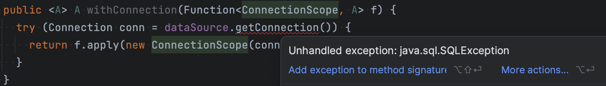
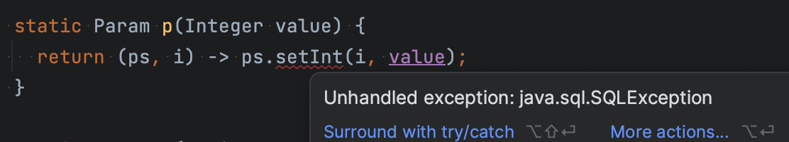

This time I'm in the mood for playing a bit with my good old friend Java. While preparing a kata for my students I wanted some **simple** database access library they could use without previous knowledge or experience. I could have looked at many alternatives, but I really wanted something simple.

Simple _like_{:.sidenote-number} _I'm assuming Java 11 or later here. As a reminder, 11 is the LTS that was released on 09/2018 and is planned to be supported through 2026. I will mostly need lambdas (which are around since Java 8, released on 3/2014 and supported through at least 2030).  You'll see `var`s as well, which would require Java 11 (counting only LTSs), but they are easy to replace with their corresponding types if you are stuck with Java 8._{:.sidenote}:

```java
List<User>  users = tx.select(
  "select u.id, u.name, u.surname from users u " +
  "where u.active = true amd u.role = ?",
  (rs) -> new User(rs.getString(1), rs.getString(2), rs.getString(3)),
  p("student") // The parameter value for the ? in the query
);
```

Summarizing the idea:

1. The user writes Plain Old Sql (pos? posql?) her database will parse, interpret and execute. Not a fancy DSL hopefully translated to the correct sql her database wants.
2. The user writes a lambda to tell the library how each row is read. She does not need to handle `ResultSet.next()`, so there is no way she can fail to do so correctly.
3. The user passes arguments in a vararg with `p(xxx)` for any admissible value `xxx` where _admissible_ means it must be a value of a type supported by the library.

I've used this very same approach with Scala (I admit some implicits where used there) and Kotlin (look, ma! no implicits!). So let's try my hand at Java.

Under the hood I'm using Jdbc. Yes, it blocks threads, but that may be solved sooner than anyone expected. And it throws ugly checked exceptions we will need to daeal with. In fact, it very poorly handles errors in a non standard way. But other than that, it is fine and very well known.

## Connections and DataSources

The functions I will offer (like `select`, `selectOne`, `update`, etc.) will need a `Connection`. As per Jdbc itself, we need to be able to use the same `Connection` to invoke several database operations in a given transaction. So let's use dependency injection! I could simply add a parameter to every funciton needing a `Connection`, but I prefer to create a class to represent the scope of a connection, a class where those fancy operations will live.

```java
public class ConnectionScope {
  private final Connection connection;

  public ConnectionScope(Connection connection) {
    this.connection = connection;
  }

  public <A> List<A> select(String sql, RowReader<A> reader, Param... params) {...}
  public int update(String sql, Param... params) {...}
  ...
}
```

So now our beloved user needs a way to get her `ConnectionScope`. The standard way to get a `Connection` is a `DataSource` that will usually have a connection pool like [HikariDb](https://github.com/brettwooldridge/HikariCP) behind it. But the main problem with `Connection` and every other resource we use is that we need to remember to `close` it. Fortunately enough, we got `Autocloseable` long ago and its a bit easier. But you can still forget to use try-with-resources. So (inspired by the idea of `Resource`in [Cats](https://typelevel.org/cats-effect/docs/std/resource) or [Arrow](https://arrow-kt.io/docs/apidocs/arrow-fx-coroutines/arrow.fx.coroutines/-resource/)) let's try to build a simple, specific API to use connections without having to remember to close them. And let's inject a `DataSource` to that function by injecing it to the class where the method is:

```java
public final class Jdbc {

  private final DataSource dataSource;

  public Jdbc(DataSource dataSource) {
    this.dataSource = dataSource;
  }

  public <A> A withConnection(Function1<Connection, A> f) {
    try (Connection conn = dataSource.getConnection()) {
      return f.apply(new ConnectionScope(conn));
    }
  }
}
```

That way we can add other operations to `Jdbc` that use the very same `DataSource`, _like_{:.sidenote-number}_I could have used `withConnection` instead of duplicating the `try-with-resources` here._{:.sidenote}:

```java
public <A> A inTransaction(Function<ConnectionScope, A> f) {
  try (Connection conn = dataSource.getConnection()) {
    conn.setAutoCommit(false);
    var res = f.apply(new ConnectionScope(conn));
    conn.commit();
    return res;
  } 
}
```

Nice, huh?

## Dealing with SQLException

Well, I'm not being totally honest with you...




No, you can't call `dataSource.getConnection()` in your `withConnection` method because it throws the checked (and dreaded) exception `SQLException`. You need to either declare to also throw it or deal with it.

But the truth is I hate `SQLException` to be checked. Unless you know how to deal with them, exceptions should be unchecked. And:

1. There are very few occasions in which I actually deal with an exception thrown by Jdbc.
2. On those rare ocassions, I don't actually know how to deal with it. Let's say I want to handle duplicate key on insert? I Google that. And last time I tried (which I do every now and then) thre is no standard way to do it. So you need to check some database vendor specific error code. Ugly.

This being just a litle game, I will simply embed that ugly exception in a `RuntimeException` and call it a day. If I ever want to recover from a duplicate key or something else I'll go and figure out a solution. Future problem, YAGNI, KISS, _etc_{:.sidenote-number} _I could use any other error handling mechanism (like an error monad), but I need this to be familiar to most Java programmers. So I'll keep it ~~simple~~ <ins>familiar</ins>._{:.sidenote}.

So:

```java
public <A> A withConnection(Function<Connection, A> f) {
  try (Connection conn = dataSource.getConnection()) {
    return f.apply(new ConnectionScope(conn));
  } catch (SQLException e) {
    throw new RuntimeException(e);
  }
}
```

The very same happens when you call not only `getConnection` but also `setAutocommit` in `inTransaction`. So...

```java
  public <A> A inTransaction(Function<ConnectionScope, A> f) {
    try (Connection conn = dataSource.getConnection()) {
      conn.setAutoCommit(false);
      var res = f.apply(new ConnectionScope(conn));
      conn.commit();
      return res;
    } catch (SQLException e) {
      throw new RuntimeException(e);
    }
  }
```

That may be starting to get unpleasant. DRY apart, I don't like the verbose nature of `try..catch`. But let's live with it. After all, this `try...catch` boilerplate is one `Alt+Enter` away in my IntelliJ. And we don't have that many of those. 

Now our users can...

```java
var jdbc = new Jdbc(dataSource);
var users = jdbc.inTransaction((tx) -> ...use the ConnectionScope...));
```

## Selecting things

Let's get that one done. It's something like...:

```java
public class ConnectionScope {
  private final Connection connection;

  public <A> List<A> select(String sql, RowReader<A> reader, Object... params) {
    try (var stmt = connection.prepareStatement(sql)) {
      for (int i = 0; i < params.length; i++) stmt.setObject(i + 1, params[i]);
      try (var rs = stmt.executeQuery()) {
        var res = new LinkedList<A>();
       	var rsv = new ResultSetView(rs):
        while (rs.next()) {
          res.add(reader.apply(rsv));
        }
        return Collections.unmodifiableList(res);
      }
    } catch (SQLException ex) {
      throw new RuntimeException(ex);
    }
  }
  ...
}
```

Don't worry about that `RowReader<A>` thing for a moment. I'm covering it later.

Some notes here, just in case you are new to Jdbc or too old to remember that:

1. Yes, `Connection` needs to be closed. And `PreparedStatement`, and `ResultSet` need to be closed too. At least they are `Autocloseable` and they caused some of my first professional nightmares back in the 1990's. So, I'll close each of them.
2. You are using `PreparedStatement.setXXX` methods like I do here, right? [Tell me you are not injecting values into the SQL query by concatenating Strings!](https://en.wikipedia.org/wiki/SQL_injection)
3. I return an `unmodifiableList` because this is as close as I can get to an immutable colleciton in the standard library. Not that it matters a lot here, since I'm returning a freshly created instance every time. But, you know, the older I get, the less I want to reason about mutability.

## Parameters

Did you see that ugly `Object` type? A signal of a disaster coming after me here... Thre is a thousand (painful) reasons I'm averse to things that could fail at compile time but fail at runtime. Did you say `select("...", ..., user1)` and `user1` is an instance of `User`, a class with 4 fields in it? No way. `stmt.setObject` won't probably like that.

So let's typesafe that. How? Ok, here is the (hopefully) cool idea I came with some time ago and I keep using everywhere I want some casual Jdbc:

- A value is a valid argument for a `PreparedStatement` if its of a type `X `such that the API of `PreparedStatement` has a method `void setX(int parameterIndex, X x)`. Boolean? Check! URL? [Wut](https://rules.sonarsource.com/java/RSPEC-2112)? Yes. `User`? Nope.
- So any pair of a value of type X and one such method of a `PreparedStatement` would be a valid argument value. Why? Because the existence of such a method in `PreparedStatement`  proves... well, that we will be able to set the parameter value in the statement.
- Let's encode that idea. A  method  `void setX(int parameterIndex, X x)` in `PreparedStatement`can be seen as a `java.util.function.Consumer` but with 3 parameters: `TriConsumer<PreparedStatement,Integer,X>` (a function from these 3 types to void)... Except Java has no `TriConsumer`class. If it had one we could model, for example, `Integer` parameters <span class="sidenote-number">as:</span> _If you are frowning at `setInt`  used with `Integer`... I know. I didn't remember. Keep reading and I'll fix it later._{:.sidenote}

```java
public class IntParam{
  private final Consumer3<PreparedStatement, Integer, Integer> 
    preparedStatementSetter;
  private final Integer value;

  public IntParam(Integer value){
    this.preparedStatementSetter = PreparedStatement::setInt;
    this.value = value;
  }
}
```

- But... a pair of  `TriConsumer<PreparedStatement,Integer,X>` and a value of type `X` can be converted by currying the function. That is, we create a `BiConsumer<PreparedStatement, Integer>` where the third argument (of type X) is whatever value we wanted to set as a parameter:

```java
public class IntParam{
  private final BiConsumer<PreparedStatement, Integer> preparedStatementSetter;

  public IntParam(Integer value){
    this.preparedStatementSetter = (ps, index) -> ps.setInt(index, value);
  }
}
```

- And now, IntParam only needs the `Integer` value in its constructor and can be abstracted. If we squint, we can model that as an abstract class with one single method that, in fact, does not depend on `Integer` at all:

```java
public abstract class Param {
  // Define aan abstract method instead of a Consumer
  public abstract void set(PreparedStatement ps, int column);
}
```

- Now that we no longer have a constructor, we need a function that, given a value, creates instances of `Param`. We could create a subclass for each type we support, but simply creating anonymous instances is easier:

```java
public Param integerParam(Integer value) {
  return new Param() {
    public void set(PreparedStatement ps, int column){
      ps.setInt(column, value);
    }
  };
}
```

- Finally, an abstract class with just one method... fits perfectly the idea of `FunctionalInterface`::

```java
@FunctionalInterface
public interface Param {
  void set(PreparedStatement ps, int i)
}
```

Now I simply need more functions that, given a value, return an instance of  `Param`. And they will use a lambda to create the resulting instance.

```java
static Param p(Integer value) {
  return (ps, i) -> ps.setInt(i, value);
}

static Param p(String value) {
  return (ps, i) -> ps.setString(i, value);
}
```

I named all such funtions `p` so that the compiler, and not our user, gets to choose which one applies to the given parameter type. And all of a sudden my beloved user doesn't need to remember what function to call, but just try `p(x)` for any `x` she wants passed as argument and only care about it if the compiler (rightfully) complains to not have any function `p` that takes values of such type as a parameter.

Now our select function can use the `Param` instance to set the parameter in a typesafe way:

```java
  public <A> List<A> select(String sql, RowReader<A> reader, Param... params) {
    try (var stmt = connection.prepareStatement(sql)) {
      for (int i = 0; i < params.length; i++) params[i].set(stmt, i + 1);
      ...
    }
  }
```

## Dealing with SQLException redux

Everything is nice and fine. Except, of course, I'm lying. Again.



Naturally, I could surrond every sinlge invocation of `setXxxx` methods with `try...catch`. But you know how many `setXxx` methods are there in `PreparedStatement`? 50. I counted them. I've been told DRY is abused often. But I'm not writing 6 extra lines of `try...catch` (including its braces) multiplied by 49 more times. Enough is enough.

But this time the solution is actually simple. Although `BiConsumer` can't represent anything that throws checked exceptions, let's simply admit our `Param` functional interface can throw SQLExceptions and, all of a sudden, you can use lambdas like there were no exceptions to be seen.

Jedi stuff. These aren't the exceptions you are looking for.


```java
@FunctionalInterface
public interface Param {
  void set(PreparedStatement ps, int i) throws SQLException;

  static Param p(Integer value) {
    return (ps, i) -> ps.setInt(i, value);
  }
}
```

It may be no rocket science if you are really used to (modern-ish) Java. But in my opinion it shows the smarts of the designers of Java. `setInt` throws SQLException but it can be written in a Lambda because the `FunctionalInterface` you expect to return (`Param`) already declares the function to throw `SQLException`.

## Nulls and autounboxing

I'm just writing about the design and implementation of this toy library. But [I'm fond of testing](https://blog.agilogy.com/series.html#introduction-to-testing) and, yes, I'm also testing it. So I've found a bug caused by my years away from Java.

Did you spot it already? It is here:

```java
static Param p(Integer value) {
  return (ps, i) -> ps.setInt(i, value);
}
```

Did you guess it? Yes, `ps.setInt` takes an `int` value. When you pass an `Integer` value, it auto-unboxes. And if the value was null... Kaboom! `NullPointerException`. I could rewrite the previous section with `String` as the example and pretend I never did the mistake. But let's be trasnparent here. I did it. And now I'm fixing it:

```java
static Param p(final Integer value) {
  return (ps, i) -> ps.setObject(i, value, Types.INTEGER);
}

static Param p(final int value) {
  return (ps, i) -> ps.setInt(i, value);
}
```

## Reading rows

Last... and, for once, possibly least. We want our user to read the rows in a `ResultSet` in such a way that:

1. She can't possibly forget to close the `ResultSet`
2. She can't possibly try to use the `ResultSet` after the `Connection` was closed (probably returned to the pool)
3. She does not need to worry about advancing the cursor with `next()`
4. She does not need to deal with primitive types and `wasNull()` (assuming we can live with wrapping every primitive value in nullable columns)

For that, we are asking our user to provide a lambda that we wil execute to read each row. As we don't want her to mess with `next()` we will handle her a trimmed-down `ResultSet` where she can only get results but not move the cursor. That class can also facilitate things when she deals with nulls and wrarper types:

```java
public class ResultSetView {

  private final ResultSet resultSet;
  public ResultSetView(ResultSet resultSet) {
    this.resultSet = resultSet;
  }
  
  public String getString(int column) throws SQLException {
      return resultSet.getString(column);
  }
  
  public Boolean getBoolean(int column) throws SQLException{
    var res = resultSet.getBoolean(column);
    return resultSet.wasNull() ? null : res;
  }
  
  public boolean getBool(int column) throws SQLException{
    var res = resultSet.getBoolean(column);
    if(resultSet.wasNull()) throw new NullPointerException("Column " + column + " is null");
    return res;
  }
  
  ...
}
```

## Selecting things, the final implementation

Finally, we can close the loop:

```java
class ConnectionScope {
  ...
  public <A> List<A> select(String sql, RowReader<A> reader, Param... params) {
    try (var stmt = connection.prepareStatement(sql)) {
      for (int i = 0; i < params.length; i++) params[i].set(stmt, i + 1);
      try (var rs = stmt.executeQuery()) {
        var rsView = new ResultSetView(rs);
        var res = new LinkedList<A>();
        while (rs.next()) {
          res.add(reader.apply(rsView));
        }
        return Collections.unmodifiableList(res);
      }
    } catch (SQLException ex) {
      throw new RuntimeException(ex);
    }
  }
}

@FunctionalInterface
public interface RowReader<A> {
  A apply(ResultSetView rs) throws SQLException;
}
```

So, same Jedi trick here: `RowReader` is a functional interface that declares to throw `SQLException`. So users of `select` can simply pass a lambda whose contents throw `SQLException` happily. Which is what our `getXxx` methods in `ResultSetView` do:

```java
List<User>  users = tx.select(
  "select u.id, u.name, u.surname from users u " +
  "where active = true amd u.role = ?",
  (rs) -> new User(rs.getString(1), rs.getString(2), rs.getString(3)),
  p(role)
);
```

## Support for differnt types

Once your users are using `Param` instead of `PreparedStatement.setXxxx` and  `ResultSetView` instead of `ResultSet`, you now can extends the capabilities of Jdbc with new types. In particular, I've always found Jdbc's lack of support for `Instant` and `java.net.URI` disturbing, just to mention a couple examples:

```java
@FunctionalInterface
public interface Param {
  ...
  static Param p(URI value) {
    return (ps, i) -> ps.setString(i, value.toString());
  }
  static Param p(Instant value) {
    return (ps, i) -> ps.setTimestamp(i, java.sql.Timestamp.from(value));
  }
}

public class ResultSetView {
	...
	public URI getURI(int column) throws SQLException {
    var res = resultSet.getString(column);
    return res == null ? null : URI.create(res);
  }
  public Instant getInstant(int column) throws SQLException {
    var res = resultSet.getTimestamp(column);
    return res == null ? null : res.toInstant();
  }
}
```

Further than that, you can hide (by omiting them from your implementation), those types you don't want your users to use directly. As an example, [let's say you have your issues with URL](https://brian.pontarelli.com/2006/12/05/mr-gosling-why-did-you-make-url-equals-suck/). You encourage your users to not use it by **not** implementing the `p` and `getUrl` methods.

## Other select and update methods

Of course, I just implemented a couple simple methods that use Jdbc in some particular ways. But you can implement any other common usage of the api in order to simplify the scenarios you and your team use the most. 

Let's see an example. Let's say your database generates a surrogate key whenever you insert a new row in a given table. Do you know how to perform a Jdbc insert and get the generated key? It was something like:

```java
public <K> K insertAndGetKey(String sql, RowReader<K> keyReader,  Param... params) {
  try (var stmt = connection.prepareStatement(sql, RETURN_GENERATED_KEYS)) {
    for (int i = 0; i < params.length; i++) params[i].set(stmt, i + 1);
    stmt.executeUpdate();
    try(var keys = stmt.getGeneratedKeys()){
      keys.next();
      return keyReader.apply(new ResultSetView(keys));
    }
  } catch (SQLException ex) {
    throw new RuntimeException(ex);
  }
}
```

So, one nice thing of our abstraction is that you can create a mehod for each typical use case. One your users will use by simply providing lambdas for the parts they are interested in. It reminds me of the template pattern, if you want. But it is simpler with lambdas.


## Recap

We developed a small, lightway Jdbc helper library that:

- Is under 300 lines of code, supporting many of the types supported by Jdbc. Probably under 500 lines if it supported all (the desirable) ones.
- Is user friendly: easy to learn, typesafe, uniform (e.g. all parameters are passed the same)
- Appropiately deals with `null` while reading / writing columns
- Encodes correct Jdbc usage patterns. e.g. Users can't forget to close `Connection`, `PreparedStatement` or `ResultSet`
- Is extensible to more methods that use Jdbc in different ways (and encodes them as easy to use templates).
- Is extensible to types not directly supported by Jdbc so that we don't repeat the needed transformations everywhere (e.g. Instant or URI columns or parameters)
- Can hide dangerous / unwanted Jdbc features (e.g. java.sql.Date, java.sql.Time or  java.net.URL columns or parameters)
