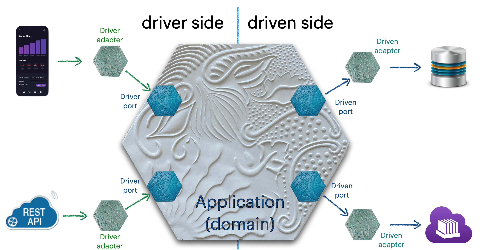
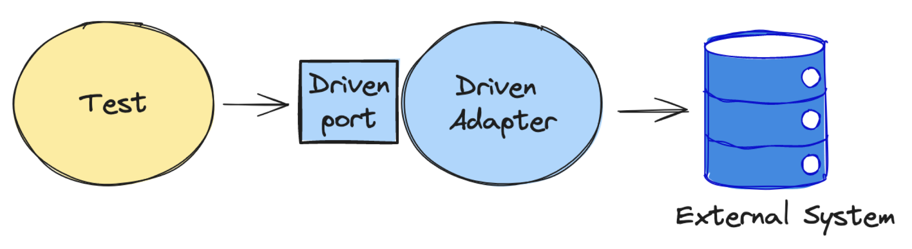

---

layout: post
title: "Testing the Agilogy Way"
author: Jordi Pradel
categories: [testing,design,hexagonal]
description: >-
  At Agilogy we have a curated way of testing software. Here I discuss smoe of my thoughts on the subject and I share the slides of an internal workshop that discuss the Principles, Patterns and Strategies to test software in Hexagonal Architectures.
---

We at Agilogy love our craft. And we like having technical discussions, trainings and workshops that allow us to continuously improve the way we develop software. That's the reason we devote part of our Friday's mornings to what we call the Agilogy School. These sessions are the weekly occasion for everyone at Agilogy to share and learn about common interests like testing, programming languages, functional programming, software architecture, design, etc.

As the main facilitator, I have decided to make 2024 the year of software testing at the Agilogy School. 

To do so, we needed a common starting point, for which we used the Hexagonal Architecture, which we reviewed so that all of us share an ubiquitous language when talking about its _components_{:.sidenote-number} _You know, driven ports and adapters, driving ports and adapters... or where they **driver** ports and adapters?_{:.sidenote}. 



From there on, we started, as we should, by the basic principles, patterns and strategies that are common to software testing in any technology or programming language.

In the following weeks or months I'll be blogging about these testing strategies we use at Agilogy. We may even write about Hexagonal Architecture before that, se we make it clear the way we talk about it.

In the meantime, I'm sharing the slides of the workshop we are working on:

<iframe src="https://www.slideshare.net/slideshow/embed_code/key/ogMuxAuuefpUOW?hostedIn=slideshare&page=upload" width="700" height="443" frameborder="0" marginwidth="0" marginheight="0" scrolling="no"></iframe>

You can download the PDF of the slides [here](/assets/SoftwareTestingTheAgilogyWay.pdf).

Furthermore, I want to take the opportunity to review things I already shared in this blog, now that I have some names for the patterns and strategies I was talking about back then.

## Pattern: Arrange, Act, Assert with State

In [What is an automated test, again?](/2022-05-27-what-is-an-automated-test-again.html) I talked about how to test methods that have state:

```kotlin
// 1. Set initial state:
val ma = MemoryAdder()
ma.add(23)
// 2 and 3. Execute the method and assert
assertEquals(25, ma.add(2))
// 4. Collect the final state and assert
assertEquals(2, ma.lastInput)
```

I have identified this way of testing methods with state as a pattern I call _**Arrange, Act, Assert with State**_, or **_AAA with State_** for short.

## Strategy: Integration Tests of Driven Adapters 

In [Testing and persistent state](/2022-06-17-testing-and-persistent-state.html) I showed how we can apply the _AAA with State_ pattern to test components whose state is persisted:

```kotlin
// 1. Set initial state
val userId = 23L
val userName = "John"
conn.execute("delete from users")
conn.execute(
  "insert into users(id, name, last_visit), ?, ?, null", 
  userId, 
  userName
)
// 2 and 3. Execute the method and assert
val lastVisit = Instant.now()
val wasUpdated = updateUserLastVisit(userId, lastVisit)
assertTrue(wasUpdated)
// 4. Collect the final state and assert
val endState =
  conn.execute("select id,name,last_visit from users order by id"){ 
    (i, n, lv) -> User(id, n, lv)
  }
assertEquals(listOf(User(userId, userName, lastVisit)), endState)
```

If we apply this to an Hexagonal Architecture, we'll see that the Driven Adapters are the perfect example of such a case. We say these are _Integration Tests_ because we are testing (part of) our system in integration with an actual external system (an actual database, in the example).





## Design for testability

In [Testing other side effects](2022-07-08-testing-other-side-effects.html) we started discussing how to test side effects other than state. That led us to discuss Dependency Injection and software design in general.
